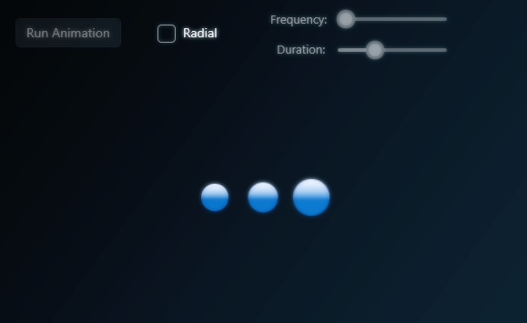

# WinUI - Animated Circles Demo

## v1.0.0.0 - October 2024

**Dependencies**

| Assembly | Version |
| ---- | ---- |
| NET Core | 8.0 |

- An animated circle demo using scale animations.
- I see this animaton everywhere on the interwebs these days so I figured I'd regenerate it using **WinUI3**.
- This is a reusable [UserControl](https://learn.microsoft.com/en-us/uwp/api/windows.ui.xaml.controls.usercontrol?view=winrt-26100) that can be added to any **WinUI3** project.

## Usage (XAML)
	
	<AnimatedCirclesControl
	    AnimationDuration="0.7"
	    AnimationFrequency="0.1"
	    CircleSize="20"
	    GradientColorOne="#00408F"
	    GradientColorTwo="#E0E0FF"
	    IsRunning="{x:Bind ViewModel.Busy, Mode=OneWay}"
	    ScaleFactor="1.5"
	    UseRadialGradient="False" />
	
	<!-- 
	- CircleSize (double)
		- Size in pixels of the circles.
	- AnimationDuration (double)
		- Time in seconds of the animation.
	- AnimationFrequency (double)
		- Time in seconds for the period of the animation.
	- GradientColorOne (Color)
		- The first color for the gradient.
	- GradientColorTwo (Color)
		- The second color for the gradient.
	- ScaleFactor (double)
		- How much to grow/shrink the circles.
	- IsRunning (bool)
		- True starts the animation, False stops the animation.
	- UseRadialGradient (bool)
		- If true then a RadialGradientBrush is used, if false a LinerGradientBrush is used.
		- If you don't want any gradient effect then set ColorOne and ColorTwo to the same value.
	-->
		
	
